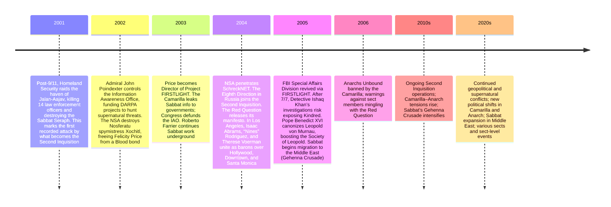

```mermaid
    timeline
      2001 : Post‑9/11, Homeland Security raids the haven of Jalan‑Aajav, killing 14 law enforcement officers and destroying the Sabbat Seraph. This marks the first recorded attack by what becomes the Second Inquisition
      2002 : Admiral John Poindexter controls the Information Awareness Office, funding DARPA projects to hunt supernatural threats. The NSA destroys Nosferatu spymistress Xochitl, freeing Felicity Price from a Blood bond
      2003 : Price becomes Director of Project FIRSTLIGHT. The Camarilla leaks Sabbat info to governments; Congress defunds the IAO. Roberto Farrier continues Sabbat work underground
      2004 : NSA penetrates SchreckNET. The Eighth Direction in Russia joins the Second Inquisition. The Red Question releases its manifesto. In Los Angeles, Isaac Abrams, “Nines” Rodriguez, and Therese Voerman unite as barons over Hollywood, Downtown, and Santa Monica
      2005 : FBI Special Affairs Division revived via FIRSTLIGHT. After 7/7, Detective Ishaq Khan’s investigations risk exposing Kindred. Pope Benedict XVI canonizes Leopold von Murnau, boosting the Society of Leopold. Sabbat begins migration to the Middle East (Gehenna Crusade)
      2006 : Anarchs Unbound banned by the Camarilla; warnings against sect members mingling with the Red Question
      2010s : Ongoing Second Inquisition operations; Camarilla–Anarch tensions rise; Sabbat’s Gehenna Crusade intensifies
      2020s : Continued geopolitical and supernatural conflicts; new political shifts in Camarilla and Anarch; Sabbat expansion in Middle East; various sects and sect‑level events
```
